# 🚕 Uber Trip Analytics — SQL, Python & Machine Learning

An end-to-end analysis of an Uber-style ride-hailing dataset — from raw data validation through 40+ SQL business questions, a full Python EDA covering revenue, drivers, riders, locations, cancellations, payments and reviews, and finally a machine learning model that predicts trip fares.

> 📊 **Dashboard (Tableau/Power BI): coming soon** — will be linked here once complete.

---

## 📌 Problem Statement

Ride-hailing platforms generate huge volumes of operational data across trips, drivers, riders, payments, and reviews. This project treats that data like a real analytics function would: clean it, understand it, question it, and turn it into decisions. Specifically, it answers:

- How healthy is the core business — trips, revenue, growth trend?
- What drives cancellations, and who cancels more — riders or drivers?
- Which drivers, riders, and locations matter most to the bottom line?
- Does surge pricing actually work, and does it hurt satisfaction?
- Can we predict a trip's fare *before* it happens?

---

## 🗂️ Dataset

A relational dataset spanning **8 tables**: `trips`, `drivers`, `riders`, `users`, `locations`, `payments`, `reviews`, `cancellations` — covering ride activity from **2019 to mid-2024** across 4 U.S. cities (New York, Chicago, Los Angeles, Houston).

---

## 🛠️ Tools & Tech Stack

| Layer | Tools |
|---|---|
| Data storage & querying | SQL (MySQL syntax) |
| Data cleaning & EDA | Python — pandas, numpy |
| Visualization | matplotlib, seaborn |
| Machine Learning | scikit-learn (Linear Regression, Random Forest) |
| Dashboard | Power BI *(in progress)* |

---

## 📁 Project Structure

```
uber-analytics-project/
├── README.md
├── sql/
│   ├── 01_data_validation_and_cleaning.sql
│   ├── 02_descriptive_kpis.sql
│   ├── 03_core_business_analytics.sql
│   ├── 04_trip_performance_and_volume.sql
│   ├── 05_revenue_performance.sql
│   ├── 06_driver_analysis.sql
│   ├── 07_rider_behaviour_and_retention.sql
│   ├── 08_location_and_zone_analysis.sql
│   ├── 09_cancellation_deep_dive.sql
│   ├── 10_payments_and_financial_ops.sql
│   └── 11_revenue_and_satisfaction.sql
├── python/
│   └── EDA_and_ML.py          # Phases 1–10: cleaning → EDA → correlation → ML
├── images/                    # 41 exported charts (01–41, referenced below)
└── dashboard/                 # Coming soon
```

> The `EDA_and_ML.py` script is organized into 10 self-contained phases (data load & cleaning, revenue/trip analysis, driver analysis, rider behaviour, location/zone analysis, cancellation deep dive, payments, reviews, correlation analysis, and machine learning) — each one prints its findings and saves its own charts, so it doubles as a readable analysis log.

---

## 🔁 Workflow

1. **SQL** (`/sql`) — 40+ business questions answered directly against the relational schema: validation, KPIs, trip performance, cancellations, drivers, locations, payments, revenue, and rider retention. Uses window functions (`RANK`, `LAG`, `NTILE`), CTEs, and multi-table joins throughout.
2. **Python EDA** (`/python`) — the same questions re-explored with pandas for deeper aggregation, visualized with matplotlib/seaborn, and extended with correlation analysis.
3. **Machine Learning** — a fare-prediction model built on the cleaned trip data, benchmarked and interpreted.
4. **Dashboard** *(coming soon)* — an interactive summary layer on top of all of the above.

> 📄 **[See `sql/README.md`]("C:\Users\vrutupatel\OneDrive\Desktop\uber project\UBER-DATA-ANALYSIS\SQL\README.md") for the full index of all 40+ SQL questions**, including data validation checks and a few operational deep-dives that don't have a chart below — not every finding needs a visual to matter.
>
> 📄 **[See `python/README.md`](python/README.md) for a phase-by-phase breakdown of the EDA & ML script**, including what each phase covers and how to run it.

---

## 💡 Key Insights

### Revenue & Pricing

Total revenue trended flat-to-slightly-growing across 2022–2024, with visible seasonality rather than a clean upward line — a sign this is a mature, steady-state market rather than one still in growth mode.

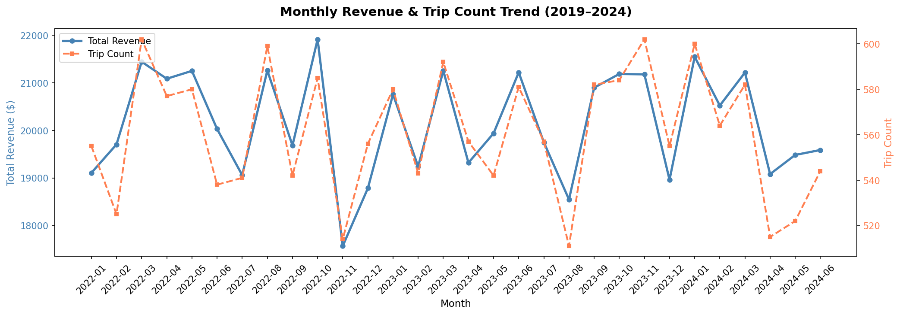

Surge pricing works as intended: average fare rises from **$28.66 (No Surge)** → **$38.01 (Low Surge)** → **$63.83 (High Surge)**, more than doubling in the highest tier.

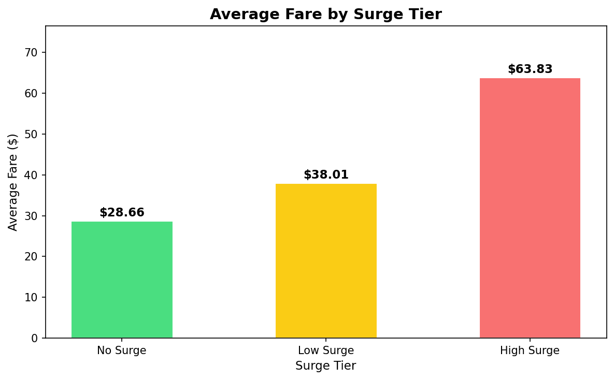

Revenue by hour peaks sharply during **morning (7–8am)** and **evening (6–7pm)** commute windows — both in total revenue and in average fare, confirming these are the hours worth prioritizing for driver supply.

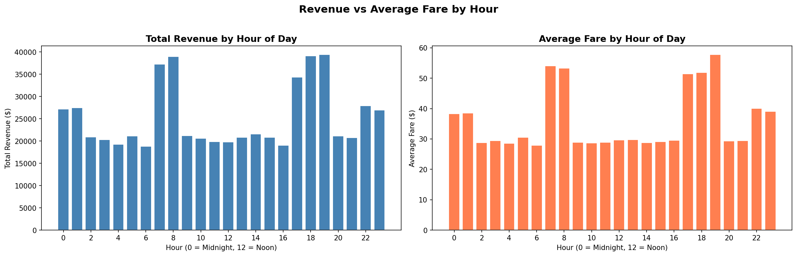
*(See: `sql/05_revenue_performance.sql`, Q5 — and `python/EDA_and_ML.py`, Phase 2)*

### Drivers

Only **12.2%** of drivers are currently inactive — a healthy supply base. Ratings skew positive (most drivers sit in the 3.5–5.0 range), and — counterintuitively — **lower-rated drivers earn a slightly higher average fare per trip** than top-rated ones, suggesting rating isn't simply a proxy for trip value.

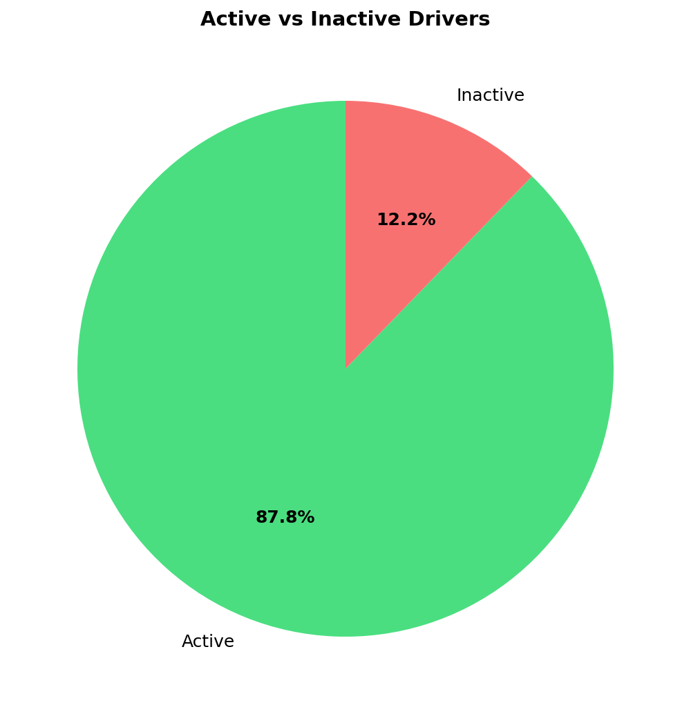
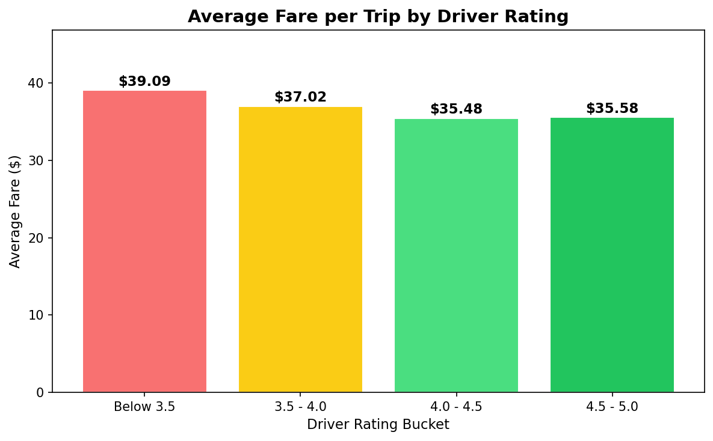
*(See: `sql/06_driver_analysis.sql`)*

### Riders & Retention

Rider value is heavily concentrated: the **High segment (20+ trips)** is a small slice of the rider base but drives **60.7%** of total revenue, while the **Low segment (1–5 trips)** contributes just 12.7% despite likely being the largest group by headcount. This is a classic power-law customer base.

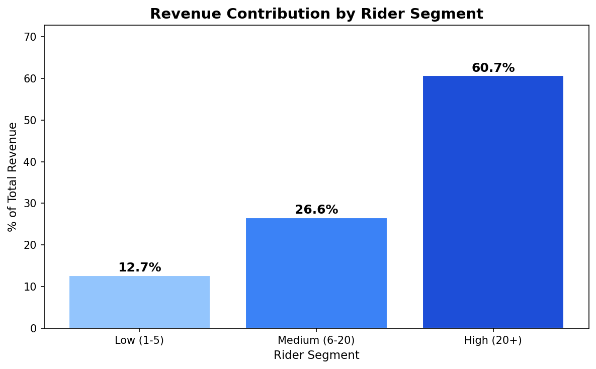
*(See: `sql/07_rider_behaviour_and_retention.sql`, Q2)*

### Location Intelligence

Airport zones dominate — both in total revenue generated and in average fare (airports significantly outprice residential, commercial, and transit-hub zones), largely because airport trips cover longer average distances.

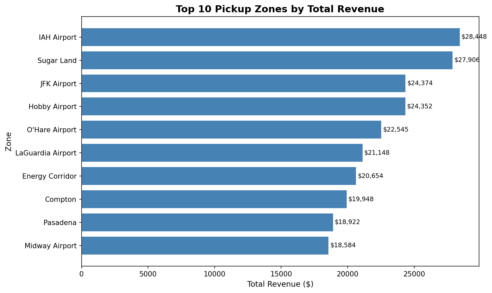
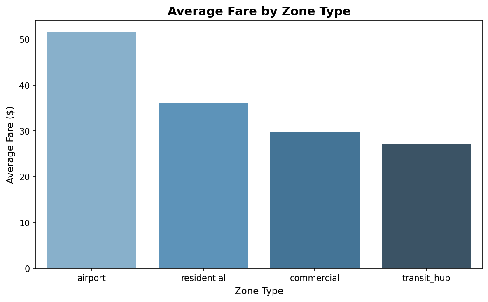
*(See: `sql/08_location_and_zone_analysis.sql`)*

### Cancellations

Riders cancel far more often than drivers — **69.8% vs 30.2%** of all cancellations. The two sides cancel for different reasons entirely: riders mostly cite **long wait times** and **changing their minds**, while drivers most often cite **wrong pickup location**. These need two different fixes, not one.

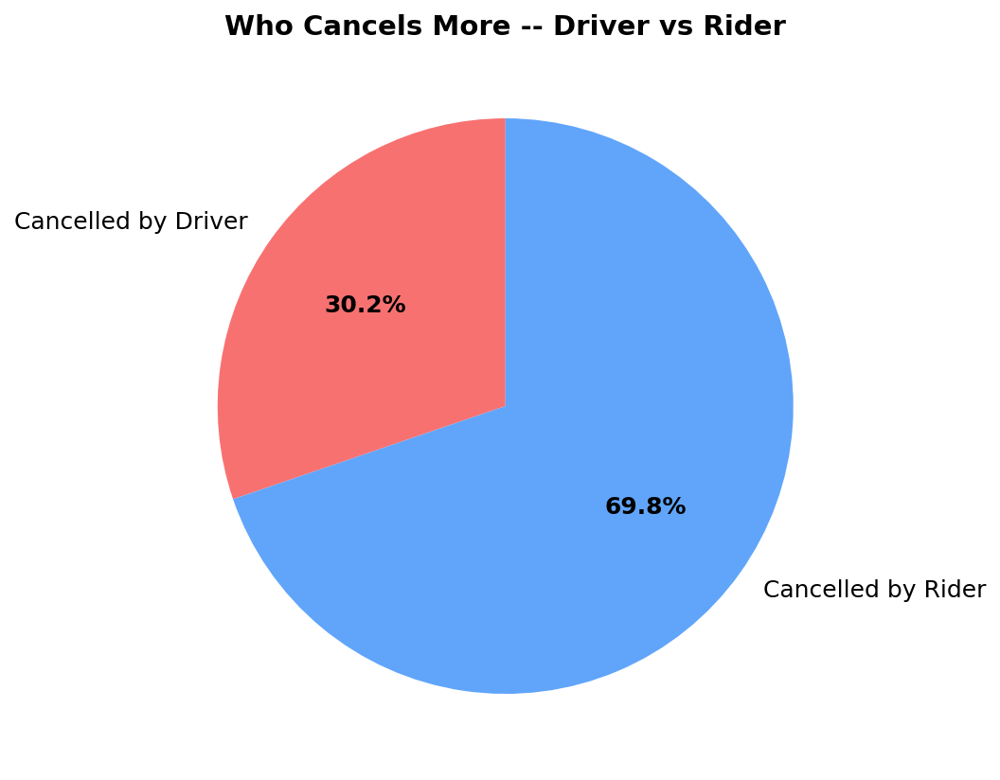
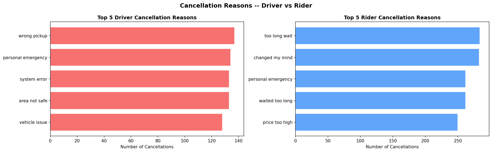
*(See: `sql/09_cancellation_deep_dive.sql`)*

### Payments

Payment method usage is almost perfectly split three ways (card 33.9%, wallet 33.3%, cash 32.8%), and all three methods show very similar failure rates (1.8–2.1%) — payment method isn't a meaningful risk factor here.

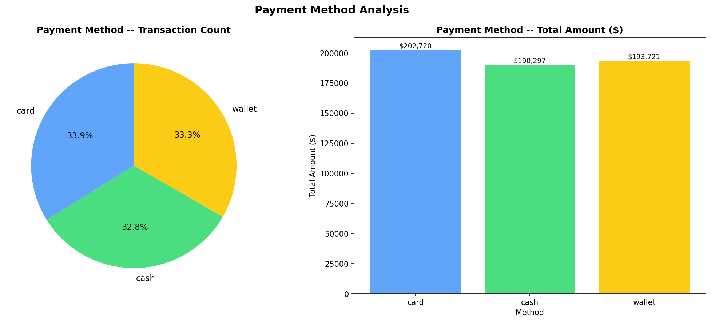
*(See: `sql/10_payments_and_financial_ops.sql`)*

### Reviews & Satisfaction

Riders rate drivers more generously than drivers rate riders (**3.83 vs 3.30** average) — a common asymmetry in two-sided marketplaces. Interestingly, review rating shows **almost no relationship with fare size** (3.62–3.68 across every fare bucket), meaning expensive trips don't get better reviews than cheap ones.

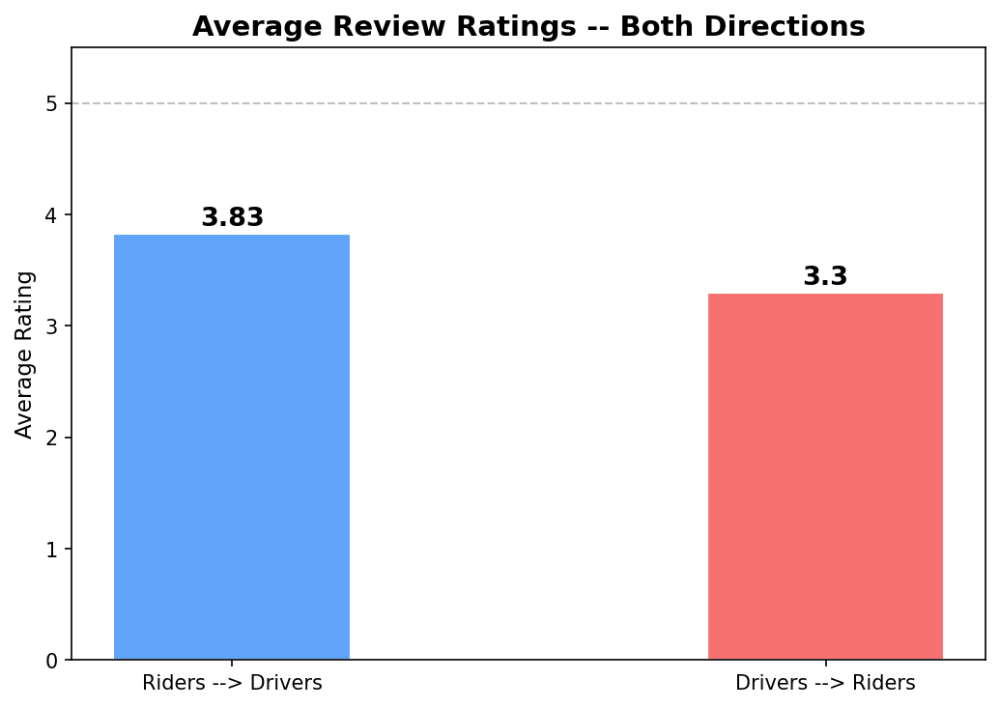
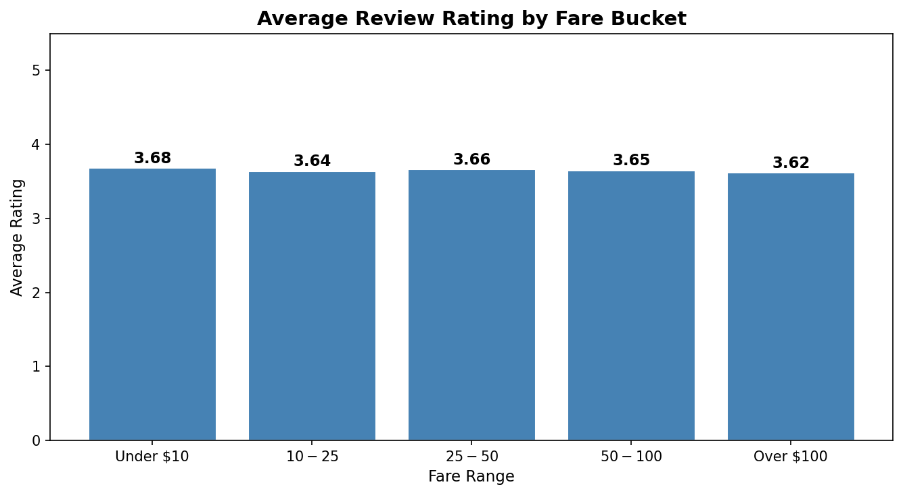
*(See: `sql/11_revenue_and_satisfaction.sql`)*

### What Actually Drives Fare?

The correlation heatmap shows `total_fare` is most strongly tied to `base_fare` (0.75), `distance_km` (0.75), `duration_mins` (0.65), and `surge_multiplier` (0.57) — and almost entirely unrelated to `hour`, `year`, or `wait_time_mins`.

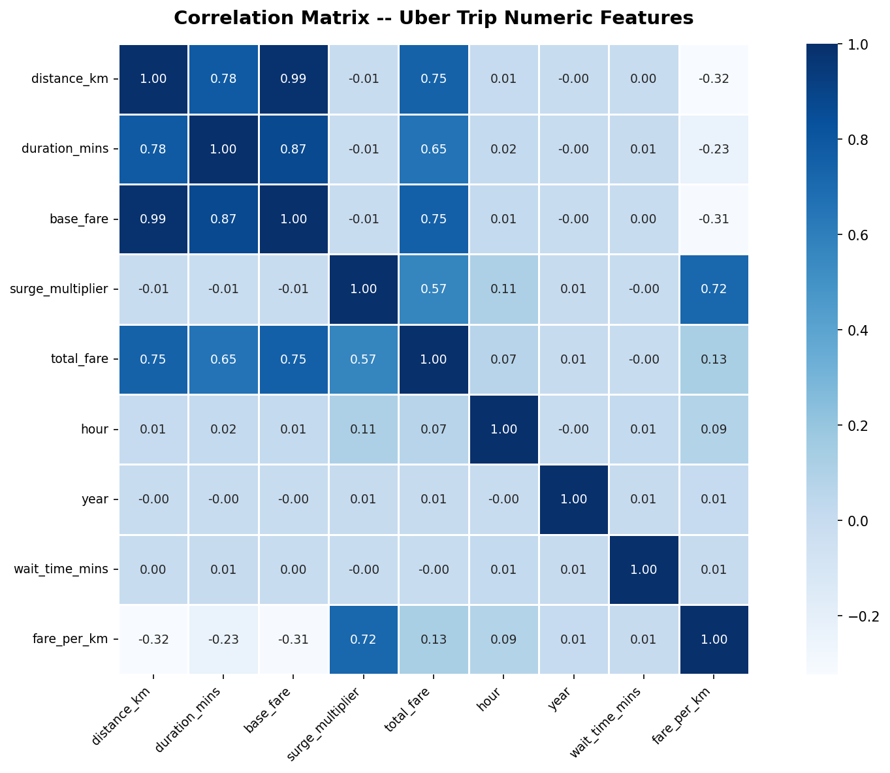
*(See: `python/EDA_and_ML.py`, Phase 9)*

---

## 🤖 Machine Learning — Fare Prediction

**Goal:** predict `total_fare` from trip-level features available *before or at* trip start — useful for an "upfront price estimate" feature.

**Features used:** `distance_km`, `duration_mins`, `surge_multiplier`, `hour`, `is_weekend`
**Models compared:** Linear Regression (baseline) vs. Random Forest Regressor (100 trees)

| Model | MAE | R² |
|---|---|---|
| Linear Regression | $5.34 | 0.8924 |
| **Random Forest** | **$0.32** | **0.9987** |

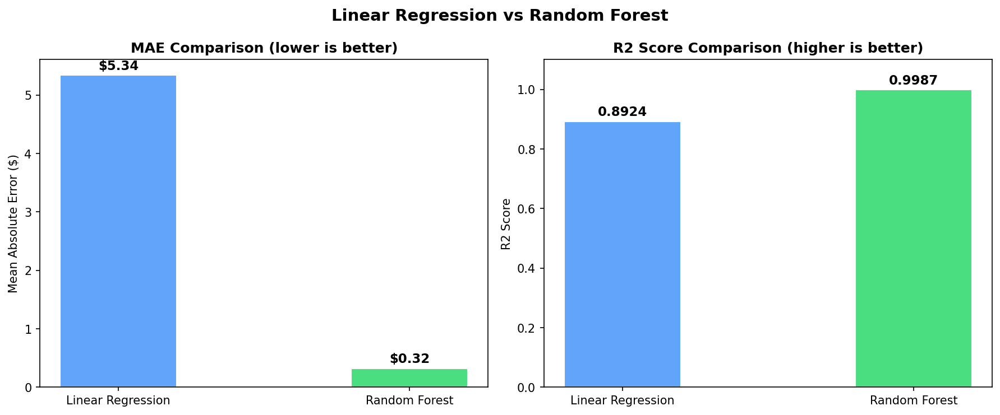

**Feature importance** confirms the pattern from the correlation heatmap: `distance_km` (0.581) and `surge_multiplier` (0.405) together account for nearly all predictive power, with `duration_mins`, `hour`, and `is_weekend` contributing almost nothing.

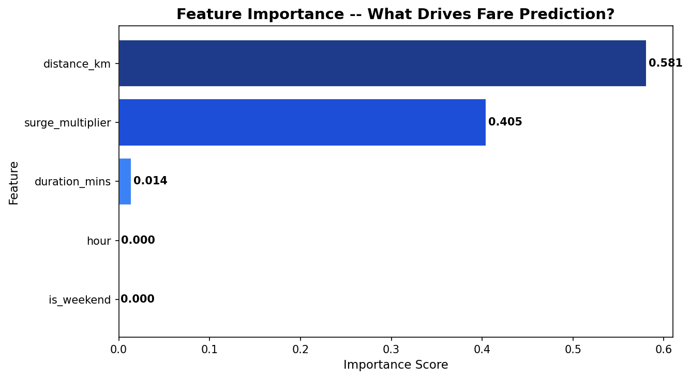
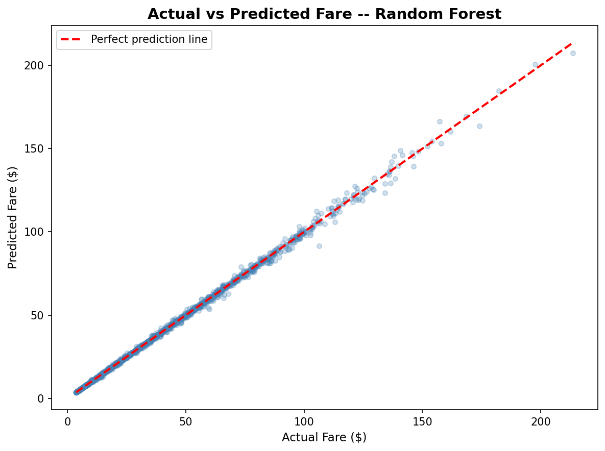

**A note on why R² is so high:** this isn't overfitting — it reflects something real in the data. `base_fare` correlates with `distance_km` at **0.99**, meaning fares in this dataset are generated by a near-deterministic formula (distance × rate, adjusted by surge). In practical terms, the Random Forest model essentially **reverse-engineered Uber's own pricing formula** from the trip data. That's a legitimate and useful finding — it validates that the feature set captures the true fare mechanism — but it also means this model would need real-world noise (traffic, tolls, promotions, driver-side variability) added before it could be trusted as a production pricing engine.

**Business use case:** this model could power an upfront fare estimate at the point of booking. Since one of the top rider cancellation reasons is "price too high" (discovered in the cancellation analysis above), showing an accurate estimate *before* the rider commits could directly reduce cancellations.

---

## 🧾 Key Findings Summary

1. **Surge pricing works as a revenue lever** but likely also contributes to rider cancellations during peak-price windows.
2. **Driver quality and platform health are strong** — 87.8% active, most drivers rated 4.0+.
3. **Revenue is concentrated in a small share of riders** (20+ trip segment = 60.7% of revenue) — retention of this group matters more than acquisition volume.
4. **Airports and commercial zones are the highest-value locations** and should be prioritized for driver supply.
5. **Riders and drivers cancel for different reasons** — wait time/price for riders, pickup/logistics issues for drivers — requiring separate interventions.
6. **Fare is highly predictable from distance and surge alone**, opening the door to a reliable upfront-pricing feature.

---

## ▶️ How to Run

1. Load the dataset into a MySQL-compatible database.
2. Run scripts in `/sql` in numeric order (01 → 11) to reproduce all 40+ business-question results.
3. Point `EDA_and_ML.py`'s `conn = sqlite3.connect(...)` / CSV paths at your local data and images folder, then run top to bottom — it will regenerate all 41 charts and the fare-prediction model.

---

## 🔜 Next Steps

- [ ] Build interactive dashboard (Tableau/Power BI)
- [ ] Add time-series forecasting for monthly revenue
- [ ] Expand ML model with real-world noise features (traffic, weather) if such data becomes available
